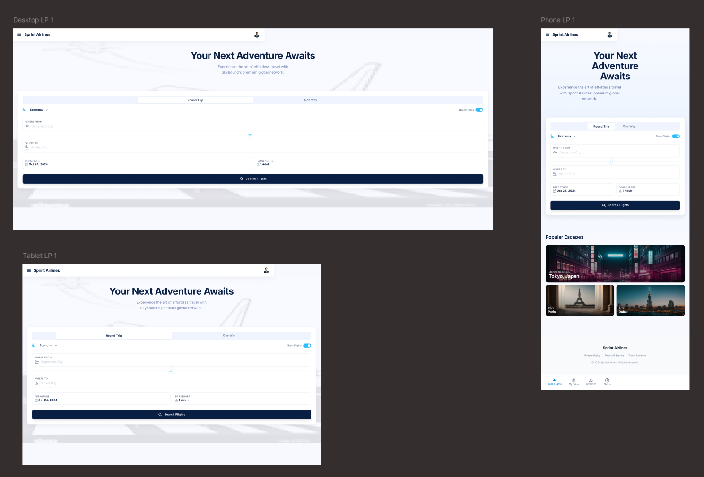
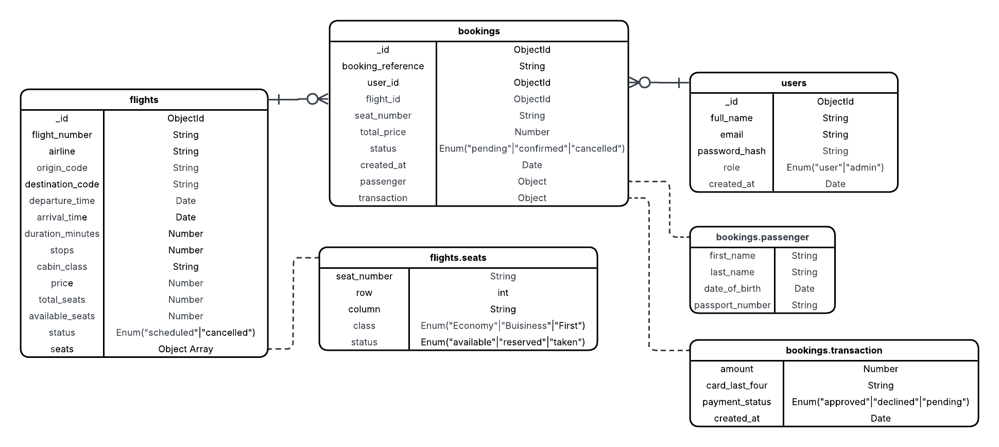

# Technical Specifications Document

  

  

## 1. Title Page

  

- **Project Name**: Sprint Airlines Booking System

  

- **Version**: 1.0

  

- **Date**: April 28, 2026

  

- **Author(s)**: Mary Pauline Desembrana, Cassius Wayne Reyes, Mario Ubando

  

  

## 2. Table of Contents

  

1. [Introduction](#3-introduction)

  

2. [Overall Description](#4-overall-description)

  

3. [Visual Mockup Reference](#5-visual-mockup-reference)

  

4. [Features](#6-features)

  

5. [Functional Requirements](#7-functional-requirements)

  

6. [Non-Functional Requirements](#8-non-functional-requirements)

  

7. [Data Requirements](#9-data-requirements)

  

8. [External Interface Requirements](#10-external-interface-requirements)

  

9. [Glossary](#11-glossary)

  

10. [Appendices](#12-appendices)

  

  

## 3. Introduction

  

- **Purpose**: The primary purpose of this Airplane Booking System is to provide a seamless, end-to-end digital solution for managing air travel logistics. It will be acting as a hub for users to browse/book flight schedules and for administrators to manage flight inventory and bookings.

  

- **Scope**: The Airplane Booking System is designed as a standalone web application focused on the core lifecycle of flight reservations. The application allows users to interact with a local database of flights through comprehensive searching, sorting, and filtewring tools, while also providing a personalized portal to manage individual bookings.

	- **MVP Requirements**

		- **User Authentication**: Secure registration and login modules.

		- **Flight Discovery**: Browsing, sorting, and filtering of available flights.

		- **Booking Engine**: Core logic for reserving flights and managing user schedules.

		- **Mock Transactions**: A simulated checkout process to finalize reservations.

		- **Administrative API**: Since the system does not use live data, the admin interface is the primary tool for creating and populating the flight database from scratch.

	- **Future Enhancements**

		- **Admin Dashboard**: A graphical interface for easier database management.

		- **Interactive Seat Selection**: A visual layout for picking specific airplane seats.

		- **Email Notifications**: Automated booking confirmations and reminders.

	- **Out-of-Scope**: The application is a simulated environment and will not handle physical airport security clearance, baggage tracking hardware, or real-time GPS flight path tracking

  

- **Definitions, Acronyms, and Abbreviations**:

	- **CRUD**: Create, Read, Update and Delete (referring to basic database operations for flight and user data).

	- **UI/UX**: User Interface and User Experience.

	- **MVP**: Minimum Viable Product

	- **API**: Application Programming Interface

	- **MongoDB**: is a source-available, cross-platform, document-oriented database program.

	- **NoSQL**: refers to a broad category of database management systems designed to handle data that does not fit neatly into the rigid, tabular relations found in traditional Relational Database Management Systems (RDBMS).

  

- **References**: None.

  

  

## 4. Overall Description

  

- **Product Perspective**: This Airplane Booking System is a standalone web application designed to simulate the interaction between a passenger and an airline's internal flight database. It serves as the primary interface for both the consumer-facing reservation flow and the internal administrative management of flight assets.

  

- **Product Functions**: The system's core functionalities are centered around three main points:

	- **Inventory Management**: Maintaining a real-time record of flight availability, routes, and seat capacity.

	- **User Lifecycle**: Managing the flow from account creation to the finalization of a flight reservation via a mock transaction.

	- **Administrative Control**: The system maintains a synthetic inventory of flight routes, allowing administrators to generate and manage simulated schedules without external dependencies.

  

- **User Classes and Characteristics**:

	- **Passengers (General Users)**: Non-technical users who require simple intuitive interface to search for flights and manage their personal itineraries.

	- **System Administrators**: Technical or clerical users who require elevated access to modify flight schedules, delete records, and manage the underlying database through the Admin API.

  

- **Operating Environment**:

	- **Client**: Modern web browsers (Chrome, Firefox, Safari)
	
	- **Server**: Node.js backend, MongoDB database

  

- **Assumptions and Dependencies**:

	- **Assumptions**: It is assumed that the users have a basic understanding of web navigation and that the "Mock Transaction" logic does not require real-world banking API verification. It is also assumed that the flight schedules provided are for demonstration purposes only and do not reflect real-world aviation timing or availability.

	- **Dependencies**:

- **Product Functions**: The system's core functionalities are centered around three main points:

	- **Inventory Management**: Maintaining a real-time record of flight availability, routes, and seat capacity.

	- **User Lifecycle**: Managing the flow from account creation to the finalization of a flight reservation via a mock transaction.

	- **Administrative Control**: The system maintains a synthetic inventory of flight routes, allowing administrators to generate and manage simulated schedules without external dependencies.

  

- **User Classes and Characteristics**:

	- **Passengers (General Users)**: Non-technical users who require simple intuitive interface to search for flights and manage their personal itineraries.

	- **System Administrators**: Technical or clerical users who require elevated access to modify flight schedules, delete records, and manage the underlying database through the Admin API.

  

- **Operating Environment**:

	- **Hardware**: Standard client-side machines (Laptops/Desktops) and mobile devices with modern web browsers (Google Chrome, Microsoft Edge, etc...).

	- **Software**: Developed using the ....

	- **Database**: MongoDB (NoSQL) used for storing flight documents, user credentials, and reservation records in a scalable, document-oriented format.

	- **Network**: Requires an active internet connection for API communication between the react frontend and the MongoDB database.

  

- **Assumptions and Dependencies**:

	- **Assumptions**: It is assumed that the users have a basic understanding of web navigation and that the "Mock Transaction" logic does not require real-world banking API verification. It is also assumed that the flight schedules provided are for demonstration purposes only and do not reflect real-world aviation timing or availability.

	- **Dependencies**:

		- **MongoDB Atlas**: The system depends on a running instance of MongoDB to store and retrieve data.

		- **Mongoose**: A dependency used to provide a schema-based solution for modeling the application data.

		- **Node.js & Express**: The backend framework required to handle API requests and database connectivity.

  

  

## 5. Visual Mockup Reference

  

- **Link or Screenshot**: 

- **Link or Screenshot**: [Link Text](https://www.figma.com/design/j5XH2WISJMGD3UH37mEnLn/Airplane-Booking-System?node-id=0-1&t=QkwSw9aWJlllqXey-0)

  

  

## 6. Features

  

- **Login and Registration Page**: Users can create accounts and login whether they are an administrator or a customer

  

- **Search and Filter**: Users can search for specific dates or places and will be given filtered results

  

- **Feature 3**: Description

  

- (Add more features as necessary)

  

  

## 7. Functional Requirements

  

### Use Cases

  

- **Use Case 1**: User Registration

	- **Description**: Users can create a new account using their name, email, and password to access the booking app.

	- **Actors**: End User

	- **Preconditions**: User is on the registration page and does not have an existing account.

	- **Postconditions**: A new user account is created and the user is automatically logged in.

	- **Main Flow**: User enters name, email, and password → User clicks "Register" → System validates input → System creates account → User is logged in and redirected to the home page.

	- **Alternate Flows**: User enters a duplicate email → System shows "Email already in use" error. | User enters a weak password → System shows password requirements error.

  

- **Use Case 2**: User Login

	- **Description**: Registered users can authenticate into the app using their email and password.

	- **Actors**: Registered User

	- **Preconditions**: User has a registered account and is on the login page.

	- **Postconditions**: User is authenticated and redirected to the home/search page.

	- **Main Flow**: User enters email and password → User clicks "Login" → System verifies credentials → Session is created → User is redirected to the home page.

	- **Alternate Flows**: User enters wrong credentials → System shows an error message and denies login. | Account not found → System prompts the user to register.

  

- **Use Case 3**: Browse, Sort, and Filter Flights

	- **Description**: Users can search for available flights and refine results by price, duration, airline, stops, or departure time.

	- **Actors**: End User (guest or logged in)

	- **Preconditions**: User is on the flight search page.

	- **Postconditions**: A filtered and sorted list of available flights is displayed.

	- **Main Flow**: User enters origin, destination, and travel date → User clicks "Search" → System fetches matching flights → User applies filters or sort options → Results update accordingly.

	- **Alternate Flows**: No flights match the search criteria → System displays a "No results found" message. | User enters an invalid or past date → System prompts the user to correct the date.

  

- **Use Case 4**: Flight Booking

	- **Description**: Logged-in users can select a flight and complete the booking by providing passenger details before proceeding to payment.

	- **Actors**: Logged-in User

	- **Preconditions**: User is logged in and has selected a flight from the search results.

	- **Postconditions**: A booking record is created with a unique reference ID and a "Pending Payment" status.

	- **Main Flow**: User selects a flight → User enters passenger details (name, date of birth, passport/ID) → User reviews booking summary → User proceeds to payment → Booking is confirmed.

	- **Alternate Flows**: User is not logged in → System redirects the user to the login page first.

  

- **Use Case 5**: Mock Payment / Transaction

	- **Description**: Users can simulate a payment transaction using mock card details without a real payment gateway.

	- **Actors**: Logged-in User

	- **Preconditions**: User has completed booking details and is on the payment page.

	- **Postconditions**: Payment is simulated and booking status is updated to "Confirmed" or remains "Pending" on failure.

	- **Main Flow**: User enters mock card details → User clicks "Pay" → System simulates payment processing → Payment is approved → Booking status is updated to "Confirmed."

	- **Alternate Flows**: Simulated card is declined (e.g. card number "0000") → System shows a "Payment failed" message and prompts the user to retry.

  

- **Use Case 6**: Seat Selection *(Optional)*

	- **Description**: Users can view an interactive seat map and choose a specific seat on their selected flight before confirming the booking.

	- **Actors**: Logged-in User

	- **Preconditions**: User has selected a flight and is in the booking flow.

	- **Postconditions**: The chosen seat is reserved and associated with the user's booking.

	- **Main Flow**: User views the seat map → User clicks an available seat → Seat is highlighted as selected → User confirms the selection → Seat is reserved against the booking.

	- **Alternate Flows**: User skips seat selection → System auto-assigns an available seat upon booking confirmation.

  

- **Use Case 7**: Booking Confirmation via Email *(Optional)*

	- **Description**: The system automatically sends an email confirmation to the user after a successful booking, containing the full itinerary and booking reference.

	- **Actors**: System (automated)

	- **Preconditions**: Booking has been confirmed and the user has a valid registered email address.

	- **Postconditions**: A confirmation email with booking details is delivered to the user's inbox.

	- **Main Flow**: Booking is confirmed → System composes a confirmation email with booking reference, itinerary, seat, and payment summary → Email is dispatched → User receives the confirmation.

	- **Alternate Flows**: Email delivery fails → System logs the error and displays an in-app notification with the booking details as a fallback. | User's registered email is invalid → System prompts the user to update their email address.

  

- **Use Case 8**: Manage Flight Data *(Optional)*

	- **Description**: Admin users can create, view, update, and delete flights and related data from a dedicated admin panel.

	- **Actors**: Admin User

	- **Preconditions**: Admin is authenticated with admin-level privileges.

	- **Postconditions**: Data changes are persisted and reflected immediately throughout the app.

	- **Main Flow**: Admin logs in → Admin navigates to the admin panel → Admin selects an entity (flights, bookings, or users) → Admin performs a CRUD action → Changes are saved and applied.

	- **Alternate Flows**: Unauthorized user attempts to access the admin panel → System blocks access and redirects to the login page. | Admin attempts to delete a flight with active bookings → System warns the admin before proceeding with the deletion.

  

### System Features

  

- **Feature 1**: User Registration and Login

	- **Description**: Allow users to register for a new account and log in to an existing one using email and password authentication.

	- **Priority**: High

	- **Inputs**: Full name, email address, password

	- **Processing**: Validate email format and password strength; hash the password; create or authenticate the user account; issue a session token.

	- **Outputs**: Authenticated session, user profile, redirect to the home page.

	- **Error Handling**: Invalid email format → inline error. Weak password → show requirements. Duplicate email on registration → "Email already in use" message. Wrong credentials on login → generic error message to prevent enumeration.

  

- **Feature 2**: Flight Search, Sort, and Filter

	- **Description**: Allow users to search for available flights by route and date, then sort and filter results to find their best option.

	- **Priority**: High

	- **Inputs**: Origin, destination, departure date, return date (optional), passenger count, cabin class

	- **Processing**: Query the flight database for matching routes; apply sort (price, duration, departure time) and filters (number of stops, airline, price range); return the refined result set.

	- **Outputs**: A sorted and filtered list of available flights with fares displayed to the user.

	- **Error Handling**: No results found → display a helpful "No flights available" message. Invalid or past date → prompt the user to correct the date.

  

- **Feature 3**: Flight Booking

	- **Description**: Allow logged-in users to select a flight and complete the booking by submitting passenger details.

	- **Priority**: High

	- **Inputs**: Selected flight, passenger information (full name, date of birth, passport or ID number), contact details

	- **Processing**: Validate all passenger data; reserve the flight slot in the system; generate a unique booking reference; associate the booking with the user's account; set status to "Pending Payment."

	- **Outputs**: A booking record with a unique reference ID and a pending payment status.

	- **Error Handling**: Missing or invalid required fields → show inline validation errors. User not logged in → redirect to login before proceeding.

  

- **Feature 4**: Mock Payment Processing

	- **Description**: Simulate a payment transaction to demonstrate the checkout flow without integrating a real payment gateway.

	- **Priority**: High

	- **Inputs**: Mock card number, expiry date, CVV, billing name

	- **Processing**: Simulate a payment gateway response using predefined test values (e.g. card "4242..." = approved, "0000..." = declined); update booking status based on the simulated result.

	- **Outputs**: Transaction result (approved or declined); booking status updated to "Confirmed" on success or remains "Pending" on failure.

	- **Error Handling**: Simulated card decline → notify the user with a reason and offer a retry.

  

- **Feature 5**: Seat Selection *(Optional)*

	- **Description**: Provide an interactive seat map that allows users to choose and reserve a specific seat on their booked flight.

	- **Priority**: Medium

	- **Inputs**: User's seat selection from the interactive seat map, booking reference

	- **Processing**: Check real-time seat availability; reserve the chosen seat against the booking; mark the seat as unavailable to other users.

	- **Outputs**: Seat assigned to the booking; seat map updated to reflect the new reserved state.

	- **Error Handling**: User skips selection → system auto-assigns an available seat upon confirmation.

  

- **Feature 6**: Booking Confirmation Email *(Optional)*

	- **Description**: Automatically send an HTML email confirmation to the user upon successful booking, containing the full itinerary and booking reference.

	- **Priority**: Medium

	- **Inputs**: Confirmed booking data (reference ID, itinerary, seat, fare breakdown), user's registered email address

	- **Processing**: Compose an HTML email using the booking data; dispatch via an email service (e.g. Nodemailer, SendGrid, or Resend).

	- **Outputs**: A confirmation email delivered to the user's registered email inbox.

	- **Error Handling**: Email delivery failure → log the error and display an in-app booking confirmation as a fallback. Invalid email on file → prompt the user to update their email address.

  

- **Feature 7**: Admin Panel *(Optional)*

	- **Description**: Provide a restricted admin interface where authorized users can create, read, update, and delete flights, bookings, and user records.

	- **Priority**: Low

	- **Inputs**: Admin credentials; flight, booking, or user data for create and edit operations

	- **Processing**: Authenticate the admin role via route-level access control; enforce permissions for each CRUD operation; validate input data before persisting changes to the database.

	- **Outputs**: Updated database records reflected immediately across the application.

	- **Error Handling**: Non-admin access attempt → block with a 403 error and redirect to the login page. Deletion of a record with active dependencies (e.g. a flight with confirmed bookings) → display a warning before proceeding. Invalid form input → show inline validation errors.

  

  

## 8. Non-Functional Requirements

  

- **Performance**: Pages should load within 2 seconds under normal network conditions. Flight search results should return within 5 seconds even with filters applied. Mock payment processing should complete and return a result within 5 seconds.

  

- **Security**: User passwords must be hashed using a secure algorithm (e.g. bcrypt) before being stored in the database. All data transmitted between the client and server must be encrypted using HTTPS. User sessions must expire after a defined period of inactivity (e.g. 30 minutes). The admin panel must be protected by role-based access control, ensuring only users with admin privileges can access it.

  

- **Usability**: The application must be easy to navigate, with a clean and consistent user interface across all screens. Error messages must be clear, specific, and actionable — telling the user exactly what went wrong and how to fix it. The seat map must be visually intuitive, clearly distinguishing available, selected, and taken seats at a glance.

  

- **Reliability**: The application should target 99.9% uptime during its operational hours. In the event of a server error, the application should display a user-friendly error page rather than exposing raw error details.

  

- **Maintainability**: All source code must be well-documented, with comments explaining non-obvious logic. The project must use version control (e.g. Git) with meaningful commit messages. Environment-specific configuration (e.g. database credentials, API keys) must be stored in environment variables, not hardcoded.

  

- **Compatibility**: The UI must be responsive and usable on screen widths ranging from 375px (mobile) to 1440px (desktop).

  

  

## 9. Data Requirements

  

 

- **Data Models**:

	- **User**: { _id, full_name, email, password_hash, role, created_at }

	- **Flight**: { _id, flight_number, airline, origin_code, destination_code, departure_time, arrival_time, duration_minutes, stops, cabin_class, price, total_seats, available_seats, status, seats[] }

	- **Flight.seats[]** *(embedded array)*: { seat_number, row, column, class, status }

	- **Booking**: { _id, booking_reference, user_id, flight_id, seat_number, total_price, status, created_at, passenger{}, transaction{} }

	- **Booking.passenger** *(embedded)*: { first_name, last_name, date_of_birth, passport_number }

	- **Booking.transaction** *(embedded)*: { amount, card_last_four, payment_status, created_at }

  

- **Database Requirements**:

	- Use MongoDB for storing all application data across three collections: `users`, `flights`, and `bookings`.

	- Seats are embedded as an array within each `flights` document; they are not a separate collection.

	- Passenger details and transaction records are embedded within each `bookings` document as subdocuments.

	- `bookings` references `users` and `flights` via ObjectId fields (`user_id`, `flight_id`).

	- Referential integrity (e.g. validating that a `flight_id` exists before saving a booking) is enforced at the application layer, not the database.

	- Seat status updates must be performed atomically using `findOneAndUpdate` with `$set` and an array filter to prevent double-booking.

	- Passwords must be hashed (e.g. bcrypt) at the application layer before being stored in `users.password_hash`.

	- `card_last_four` is the only payment field persisted; full card numbers must never be stored.

  

- **Indexes**:

	- `users.email` — unique index.

	- `flights`: compound index on `{ origin_code, destination_code, departure_time }` to support flight search queries.

	- `bookings.booking_reference` — unique index.

	- `bookings.user_id` — index to support booking history lookups per user.

  

- **Data Storage and Retrieval**:

	- Users can retrieve their account information and full booking history, including passenger and transaction details, from the `bookings` collection.

	- Flight search queries filter the `flights` collection by `origin_code`, `destination_code`, and `departure_time`, with optional sorting by price, duration, or departure time.

	- Seat availability for a specific flight is read directly from `flights.seats[]` and reflects the current status of all seats in real time.

	- Booking confirmation pages retrieve the booking document and use `$lookup` on `flights` to display full flight details.

	- Admin users can read, create, update, and delete documents across all three collections.

	- Cancelled bookings retain their document with `status: "cancelled"` and are never deleted, preserving the audit trail.

  

- **Data Validation Rules**:

	- `users.email` must be unique and match a valid email format.

	- `users.password` must meet minimum strength requirements before being hashed and stored.

	- `flights.departure_time` must be a future datetime when a flight is created or updated.

	- `flights.price` and `booking.transaction.amount` must be non-negative numbers.

	- `bookings.status` transitions must follow the flow: `pending → confirmed → cancelled`; confirmed bookings cannot revert to pending.

	- `flights.seats[].status` must transition `available → reserved` on booking start, and `reserved → taken` on payment confirmation; if payment fails, it must revert to `available`.

  

## 10. External Interface Requirements

  

- **User Interfaces**: Provide sketches or descriptions of the user interface.

  

- **API Interfaces**: Briefly describe any APIs.

  

- **Hardware Interfaces**: Mention any required hardware interactions.

  

- **Software Interfaces**: Note any software interactions.

  

  

## 11. Glossary

  

- **Term 1**: Definition

  

- **Term 2**: Definition

  

  

## 12. Appendices

  

- **Supporting Information**: Add any additional information here.

- **Revision History**: Record any changes made to the document with dates and descriptions.

